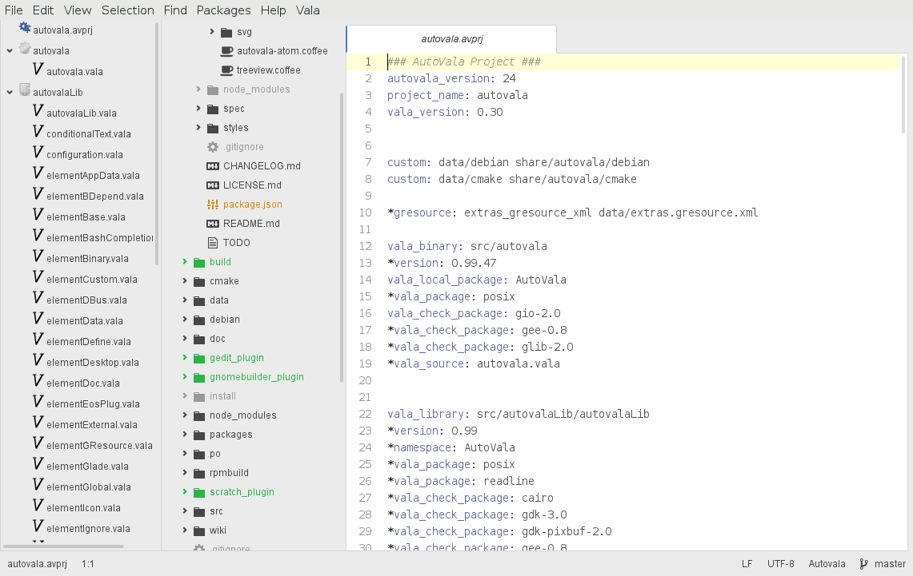

# autovala-atom package

This is an Atom package that simplifies working with AutoVala.

Autovala can be obtained from the GIT repository, at

	git://github.com/rastersoft/autovala

or from the author's homepage:

	http://www.rastersoft.com

# Using autovala-atom

Autovala-atom adds an extra left panel, which is shown only when a .vala file that belongs to an Autovala project is being edited. It also changes the path in the project view to make it point to the Autovala project to which the file belongs. Changing to a different .vala file refreshes both panels, so you don't need to add the Autovala projects to the project manager: just opening any file from an Autovala project will switch the content in both panels.
